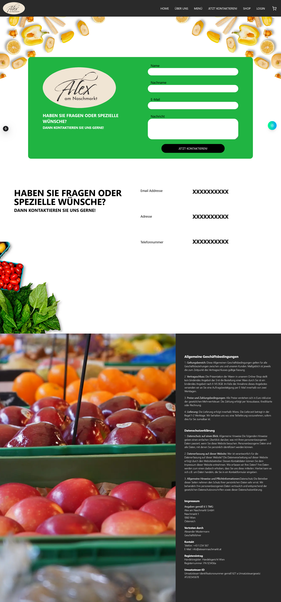
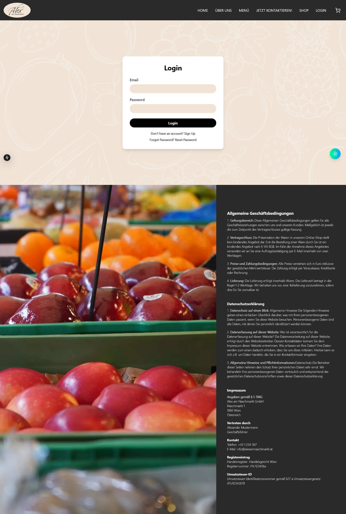
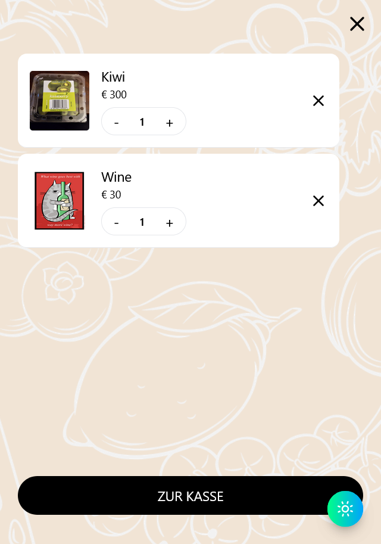
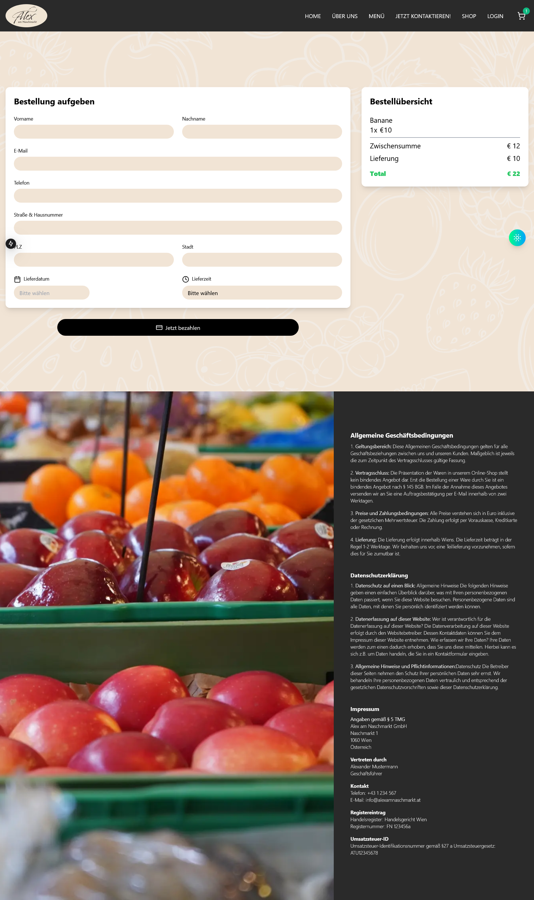
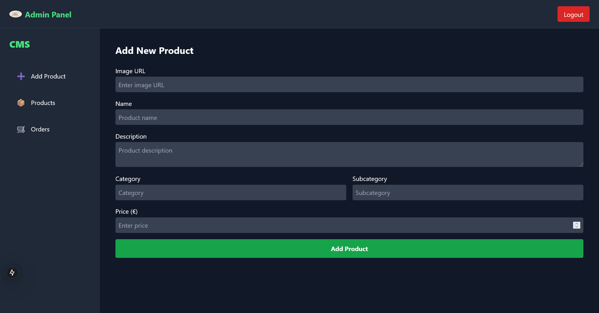
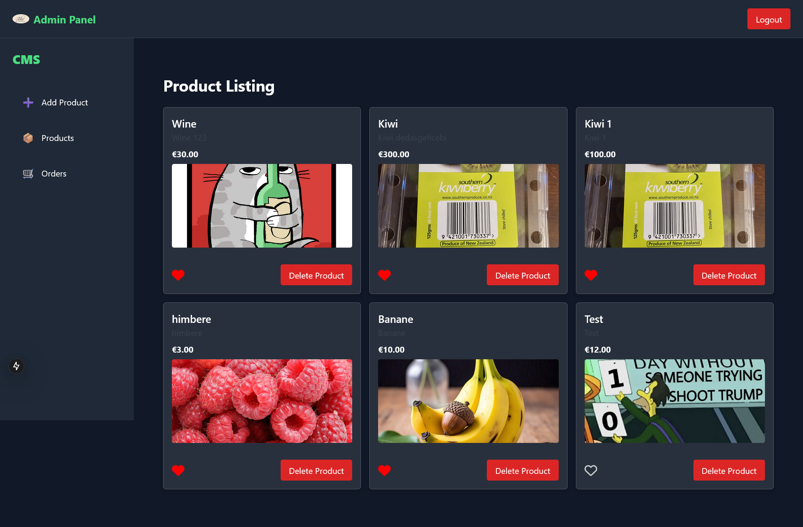
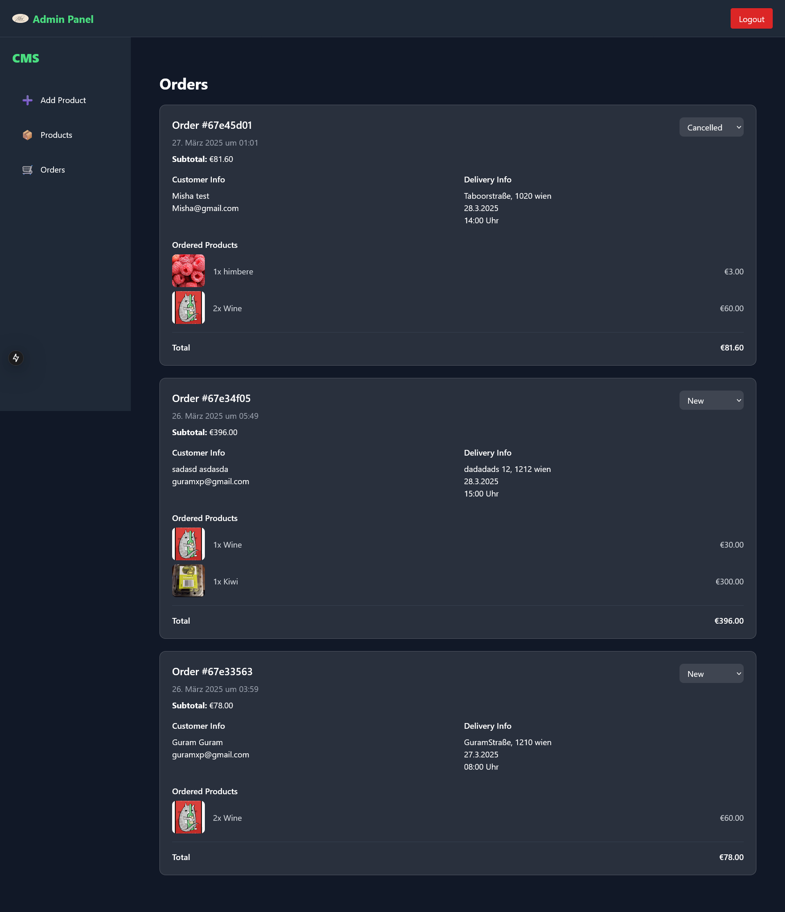

# German Grocery Store E-commerce Application

A German grocery store e-commerce application built for a client with the following features:

## Features

- **Authentication**
- **Shop**
- **Menu Downloader**
- **Contact Form**
- **Cart**
- **Admin Dashboard**
- **Favorite Products**
- **Reset Password**
- **MongoDB Integration**
- **Password Hashing**

## Known Issues

The application currently suffers from a **hydration error** due to inexperience in backend development. As a result, it cannot be deployed at the moment. However, work is in progress to resolve the issue and deploy the application soon.

## How to Start

```bash

npm i
npm run dev

```

## Screenshots

### Homepage


### About


### Menu


### Contact



### Shop


### Login



### Cart



### Place Order



### Add Product



### Products



### Orders


